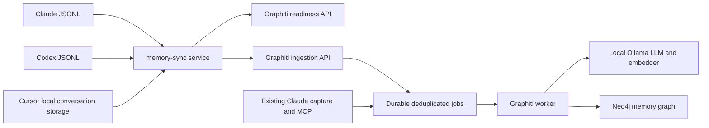

# Optional local memory synchronization

## Scope and deployment

Synchronize all available human-authored user messages from Claude Code, Codex,
and Cursor into the independently deployed `graphiti-memory` repository. Assistant
replies, tool results, and injected system instructions are excluded. There is no
"memory-worthy" content classifier or minimum message-length threshold. Existing
usage collection remains content-free.

`ai-gateway` owns source adapters and a separate `memory-sync` microservice.
`graphiti-memory` owns ingestion, durable jobs, extraction, Ollama configuration,
and Neo4j. Deployments communicate through a versioned HTTP API; they do not
share databases, Python modules, or queue files.



## Ownership and optional behavior

- Configure `GRAPHITI_URL` on `memory-sync`; absent configuration disables sync
  without opening source transcripts. This URL is the independently deployed
  Graphiti API, not the Ollama endpoint.
- Graphiti loads its own local LLM and database configuration. Its readiness
  response distinguishes a running API from usable models/database.
- Readiness failure pauses delivery and is retried. Accepted jobs remain durable
  even if Ollama subsequently becomes unavailable. Usage services stay available.
- Source mounts are read-only. Sender delivery checkpoints are owned by
  `memory-sync`; Graphiti alone owns job/extraction state.
- Container deployment uses an explicit reachable Graphiti URL, such as
  `http://host.docker.internal:8793`; container localhost is not the host.

## Shared HTTP contract v1

`GET /healthz` checks API/job-store liveness, not extraction readiness.

`GET /v1/status` returns at least:

```json
{"version":1,"ready":true,"capabilities":{"ingest":true},"dependencies":{"llm":true,"embedder":true,"neo4j":true},"queue":{"pending":0,"failed":0}}
```

`POST /v1/episodes` accepts an atomic batch (maximum 100 messages, 2 MiB body,
256 KiB UTF-8 text per message):

```json
{"version":1,"messages":[{"source":"claude_code","session_id":"session-123","uuid":"message-456","speaker":"user","text":"ok","timestamp":"2026-09-22T05:00:00Z","group_id":"personal"}]}
```

Sources are `claude_code`, `codex`, or `cursor`. All listed message fields are
required and timestamps must be valid RFC3339. Blank text is rejected. Stored
timestamps are canonicalized to UTC microsecond precision. `group_id`
accepts ASCII letters, digits, hyphens, and underscores, matching Graphiti's group
constraints. On durable
acceptance the API returns HTTP 202 and
`{"accepted":1,"duplicates":0}`. A replay returns accepted=0, duplicates=1.
Malformed batches return 400 without partial acceptance. Authentication, when
configured using `GRAPHITI_API_TOKEN`, uses `Authorization: Bearer <token>` on
status and ingestion. Health exposes no message content or secrets.

Identity is `(group_id, source, session_id, uuid)`. Duplicate identities with
different payloads return 409 rather than silently replacing stored messages.
The sender retains stable source IDs or deterministic content/position identities
where the source has no ID. It marks delivery only after durable acceptance.
Receiver jobs survive restart, retry transient failures with backoff, and expose
failed jobs instead of advancing an offset and losing a message. Graph extraction
uses deterministic episode UUIDs and explicitly handles an already-stored episode
on retry; an uncertain extraction outcome must not be presented as exactly-once.
Verified legacy episodes retain their historical UUID: before replay, match the
original name, namespace, source description, content, and timestamp, then persist
the resolved UUID. Ambiguous or mismatched legacy episodes fail for inspection.
Explicitly excluded nonhuman records retain receipts but are never claimed by
the worker or counted as successful human-message deliveries.

## Source coverage and migration

Claude and Codex adapters read both historical and subsequently appended messages.
Cursor adapters must use actual local conversation storage; the existing Cursor
usage API contains accounting metadata and cannot supply chat text. Missing or
unsupported storage is reported per source, never shown as successful empty sync.
Remote or deleted conversations absent from local storage cannot be reconstructed.
Codex source metadata determines the dialect: VS Code sessions use user-role
`response_item` messages, while CLI/event-style sessions use `event_msg/user_message`.
Explicit `source.subagent` sessions are excluded in both dialects. The chosen
dialect keeps message identity stable if alternate representations arrive later.
Browser/configuration/image context is removed while accompanying human text and
questionnaire answers are preserved. Unrecognized response-only formats are
reported as unsupported. Modern Cursor
coverage uses global `cursorDiskKV` composer/bubble identities, including retained
branch history, and excludes explicitly simulated messages and subagent tasks.
Legacy workspace-only Cursor chat formats are reported as unsupported.

The existing Graphiti Claude hook and new adapter use the same Claude session and
message UUID and default `personal` group. Existing queue records are imported
with their identity to prevent duplicate scheduling during coexistence. Legacy
processed offsets do not prove successful graph writes: the old worker skipped
errors. Preserve legacy files and explicitly document migration/backfill behavior.

## Validation and operations

Test source parsing, short user messages, replay, restart, malformed batches,
identity conflicts, disabled configuration, unavailable dependencies, retries,
and source-level errors. Exercise two independently running services over HTTP
using isolated fixture transcripts and an isolated memory namespace, then check
real dependency readiness without exposing private conversation content.

Runtime status distinguishes queued/delivered messages from successfully extracted
episodes. Do not log message bodies or credentials. API exposure outside localhost
requires authentication and a trusted network/TLS termination. Model downloads,
cloud inference fallback, and modifications to unrelated services are outside scope.

## Repeatable cross-repository verification

With Graphiti's virtualenv installed and Ollama/Neo4j running:

```sh
python3 scripts/test-memory-integration.py --graphiti-root /absolute/path/to/graphiti-memory
```

The harness launches independent Python and Go processes with temporary stores and
synthetic three-source transcripts. It checks real model/database readiness, API
authentication, short user messages, assistant exclusion, durable acceptance,
atomic validation, identity conflicts, replay, dependency outage, and restart.
It does not read real transcripts or execute graph extraction. Graphiti's own
worker tests and isolated live extraction check cover the extraction stage.

## Local operation

The local deployment keeps `gateway` and `memory-sync` in Docker, with
`memory-sync` owning the `memory_sync` PostgreSQL database. Graphiti's API and
worker run as separate host processes and share only their private jobs store.
The host API listens on `127.0.0.1:8793`; the container uses
`http://host.docker.internal:8793`. Existing Ollama and Neo4j remain Graphiti-owned.

On the configured macOS installation, `com.leapxpert.graphiti-api` and
`com.leapxpert.graphiti-worker` are launchd services. Inspect with
`launchctl list <label>`. Restart a service after Python code changes: an existing
process keeps its already-loaded code. The API can restart while the durable
worker runs, and the sender retries connection failures.

Check `GET /_memory` through the gateway for source coverage and delivery state,
and `GET /v1/status` on Graphiti for extraction state. `pending=0` at the sender
means every discovered eligible message was durably accepted; it does not mean
Graphiti's extraction backlog has drained. Retained `excluded` records document
messages rejected as nonhuman and never enter the extraction queue.
